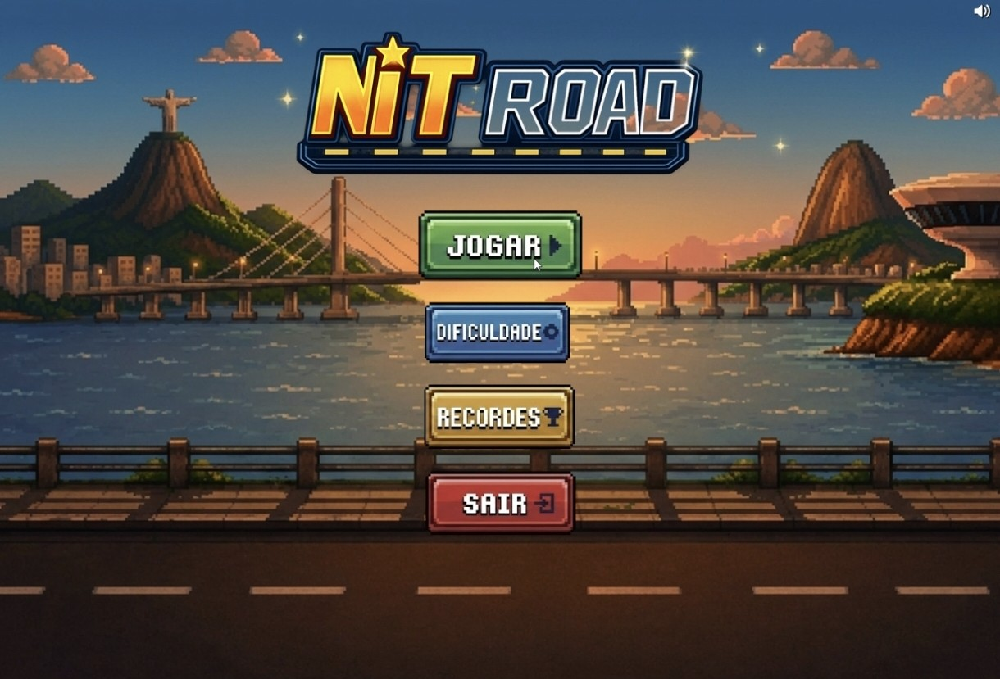
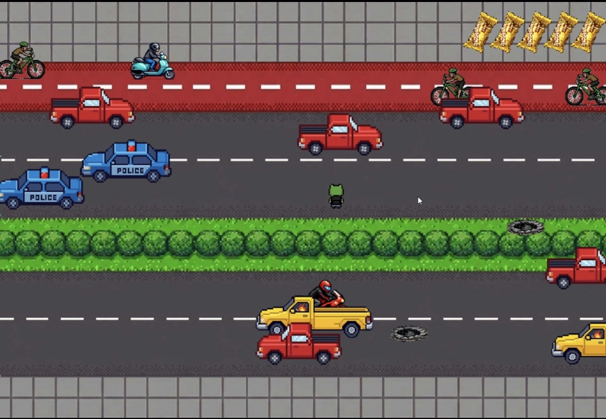
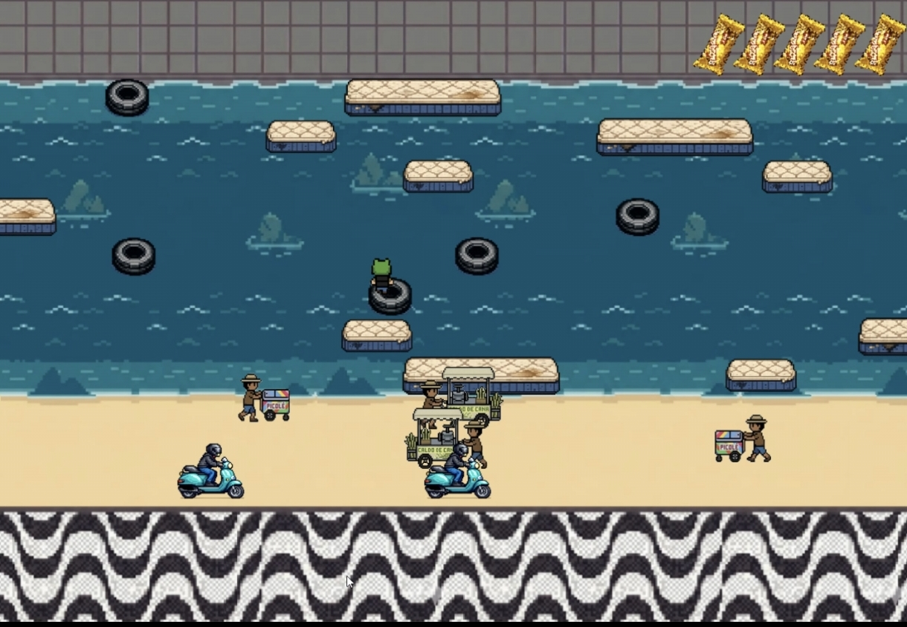

# 🚗 NitRoad

Desvie do trânsito, sobreviva pelo maior tempo possível e conquiste o topo do ranking!

NitRoad é um jogo arcade 2D de sobrevivência onde você precisa desviar dos veículos que trafegam pela estrada. Quanto mais tempo permanecer vivo, maior será sua pontuação. Teste seus reflexos, desafie seus limites e tente alcançar o melhor resultado possível.

🎮 **Baixar/Jogar:** https://miguelmfr.itch.io/nit-road

📺 **Trailer Oficial:** https://www.youtube.com/watch?v=_pP3HYkAgEM

---

## 🎮 Sobre o jogo

Em NitRoad, o objetivo é simples: sobreviver.

Controle seu veículo, evite colisões e enfrente um trânsito cada vez mais desafiador. O jogo oferece diferentes níveis de dificuldade para jogadores iniciantes e experientes.

### Principais características

- 🚗 Jogabilidade simples e viciante
- ⚡ Desafio baseado em reflexos e tempo de reação
- 🎯 Sistema de pontuação por sobrevivência
- 🔥 Três níveis de dificuldade
- 🔊 Controle de volume
- 🎵 Música e efeitos sonoros configuráveis
- 🏆 Sistema de recordes

---

## 📸 Capturas de tela

### Menu Principal

<p align="center">
  
</p>

### Gameplay

<p align="center">
  
</p>
<p align="center">
  
</p>


---

## 🕹️ Controles

| Tecla | Função |
|--------|--------|
| ↑ ou W | Mover para cima |
| ↓ ou S | Mover para baixo |
| ← ou A | Mover para a esquerda |
| → ou D | Mover para a direita |
|  ENTER | Confirmar |
|   ESC  | Voltar/Sair |

---

## ⚙️ Configurações

O jogo possui um menu de configurações que permite:

- Alterar a dificuldade
- Ajustar o volume
- Ativar ou desativar a música
- Ativar ou desativar os efeitos sonoros

---

## 🚀 Como executar

### Requisitos

- Python 3.10+
- Pygame

### Clonar o repositório

```bash
git clone https://github.com/SEU-USUARIO/nit-road.git
cd nit-road
```

### Executar

```bash
python main.py
```

---

## 🛠️ Tecnologias Utilizadas

- Python
- PPlay
- Pygame

---

## 📂 Estrutura do Projeto

```text
nit-road/
│
├── entities/
├── images/
├── sounds/
├── Telas/
├── PPlay/
│
├── assets.py
├── config.py
├── fases.py
├── main.py
├── sounds.py
├── sprites.py
│
├── recordes.txt
├── save.json
│
└── README.md
```

---

## 🎯 Objetivo

Desviar dos veículos e sobreviver pelo maior tempo possível para conquistar a maior pontuação.

Quanto mais você joga, mais difícil fica.

Você consegue chegar ao topo?

---

## 📈 Planejamento Futuro

- Novos veículos
- Novos cenários
- Conquistas
- Ranking online
- Estatísticas de partidas
- Novos modos de jogo

---

## 📄 Licença

Este projeto é distribuído sob a licença MIT.

---

## 👨‍💻 Autores

* Miguel Ferreira — https://github.com/MiguelMFR
* Caio Ramalho — https://github.com/caiorpsouza

---

⭐ Se você gostou do projeto, considere deixar uma estrela no repositório!
